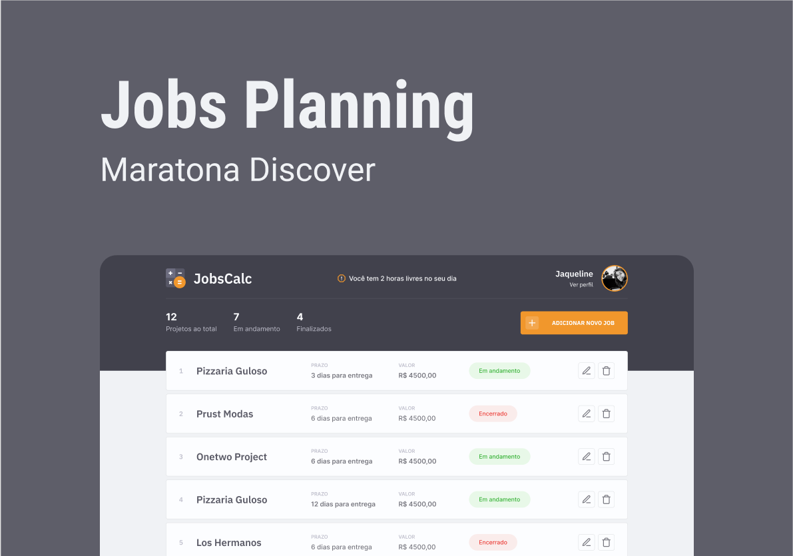

# JobsCalc

💻 Projeto

O JobsCalc é uma aplicação de estimativa de cálculo para projetos freelancer, onde é possível cadastrar e excluir jobs (projetos), obtendo uma estimativa de custo de cada job. Além disso, é possível traçar o valor da hora da pessoa que estará usando o sistema 💰

##  Tecnologias usadas no projeto

## Link da aplicação

👉🏼[Clique aqui para accessar](https://convert-template.netlify.app/)

## 🔖 Layout

Você pode visualizar o layout do projeto através [desse link](https://www.figma.com/file/s4fytPFbDiSkv4GPSfKaLE/Jobs-Planning). É necessário ter conta no [Figma](https://figma.com) para acessá-lo.

## 🔗 Deploy 

## 💻 Sobre mim 😄
 Entusiasta da programação e estudante de Engenharia de Software com foco em        desenvolvimento front-end rumo ao full stack. Dedicado a criar experiências digitais inovadoras que impactam o mundo através da tecnologia.

## 🔗 Contato 

## :memo: Licença

Esse projeto está sob a licença MIT. Veja o arquivo [LICENSE](.github/LICENSE.md) para mais detalhes.

---

